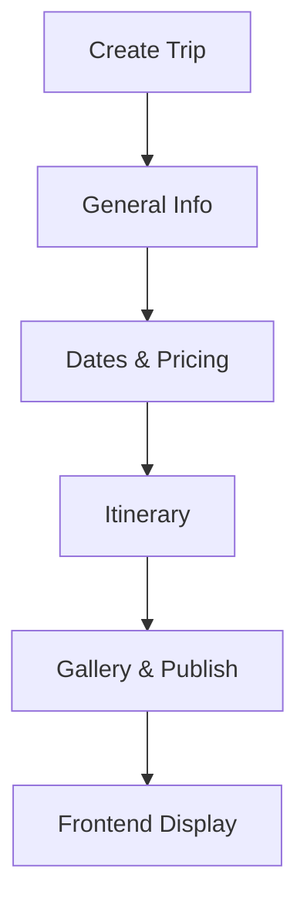

## Overview

WP Travel Engine lets you create comprehensive trip listings tailored for travel agencies and tour operators. You can add everything from basic details like destination and overview to advanced features such as multi-day itineraries, dynamic pricing, seat allocation, and image galleries. This guide walks you through the essential steps to build and manage trips effectively.

<Callout kind="tip">
Start with the basics like general information and pricing, then layer on itineraries and galleries for richer listings that convert visitors into bookings.
</Callout>

## Key Trip Components

Use these core elements to construct engaging trip pages:

<Columns cols={3}>
  <Card title="General Info & Overview" icon="map-pin">
    Set trip title, description, location, and highlights to attract search traffic.
  </Card>
  <Card title="Dates, Pricing & Capacity" icon="calendar">
    Configure availability, costs, and seating with optional FSD plugin integration.
  </Card>
  <Card title="Itineraries & Galleries" icon="image">
    Build day-by-day plans and visual media to showcase the experience.
  </Card>
</Columns>

## Step-by-Step: Create a New Trip

Follow these steps in your WordPress admin dashboard to set up a complete trip.

<Steps>
  <Step title="Add General Information" icon="info">
    Navigate to **Trips > Add New**. Enter the trip title, slug, and featured image. In the **Trip Overview** metabox, add a compelling summary.

    Use the excerpt field for SEO-friendly meta descriptions.
  </Step>

  <Step title="Set Dates and Pricing" icon="dollar-sign">
    In the **Trip Date & Price** metabox, add start/end dates, sale price, and regular price. Enable seat allocation if using the FSD add-on.

````jsx
// Example pricing structure (via metabox fields)
Regular Price: $1,250
Sale Price: $999
Duration: 7 days
Max Capacity: 20 seats
````

  </Step>

  <Step title="Build the Itinerary" icon="map">
    Use the **Trip Itinerary** metabox to add daily entries. For each day, specify title, description, and optional images.

    <CodeGroup tabs="Day 1,Day 2">
```html
Day 1: Arrival in Kathmandu
- Transfer to hotel
- Welcome dinner
```

```html
Day 2: Sightseeing Tour
- Visit Swayambhunath Temple
- Explore Thamel markets
```
    </CodeGroup>
  </Step>

  <Step title="Add Includes/Excludes and Gallery" icon="gallery">
    In **Trip Includes/Excludes**, list amenities like meals and accommodations. Upload images to the **Trip Gallery** metabox.

    Publish the trip and preview the single trip page.
  </Step>
</Steps>

## Configuring Galleries and Duration Display

Enhance visuals and usability with galleries and duration info.

<Tabs>
  <Tab title="Image Gallery" icon="image">
    Add multiple images via the dedicated metabox. They display in a responsive slider on the frontend.

    <ParamField body="gallery_images" param-type="array" required="true">
      Array of image URLs or media IDs.
    </ParamField>
  </Tab>

  <Tab title="Trip Duration" icon="clock">
    To show duration on single pages, enable the option in **WP Travel Engine > Settings > Single Trip**. Use shortcode `[wptravel_duration]` in templates.

````php
// In your theme's single-travel.php
echo do_shortcode('[wptravel_duration]');
````

  </Tab>
</Tabs>

## Best Practices and Troubleshooting

- **SEO Optimization**: Use descriptive titles and overviews with target keywords like "Nepal Trekking Adventure".
- **Capacity Management**: Integrate the FSD plugin for real-time seat tracking to prevent overbooking.
- **Mobile Responsiveness**: Test galleries and itineraries on devices.

<Expandable title="Advanced: Custom Fields" default-open="false">
For custom trip data, use the **Trip Info** metabox or ACF integration.

```php
// Register custom meta
add_action('wptravel_init', function() {
  wptravel_register_trip_meta('custom_guide', 'Guide Name', 'text');
});
```
</Expandable>

<Callout kind="alert">
Always update trip availability after major changes to avoid booking conflicts.
</Callout>



Link trips to pages using `[wptravel_trip_search]` shortcode for dynamic listings.