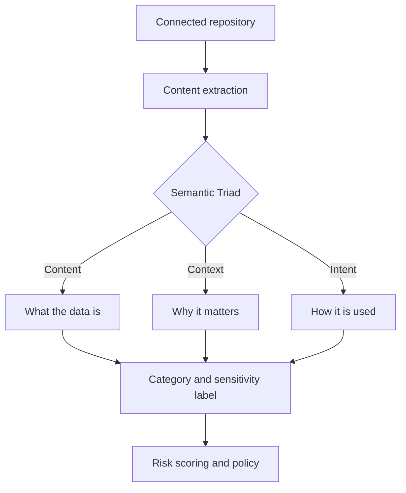

## Overview

ARMOR DSPM classifies documents with an AI inference engine rather than pattern matching alone. Every asset is evaluated across the **Semantic Triad**: what the data *is* (Content), why it matters to the business (Context), and how it is meant to be used (Intent). This lets ARMOR label nuanced assets such as source code, trade secrets, and regulated records that keyword rules routinely miss.

<Callout kind="info">
  The Semantic Triad is the core concept behind classification accuracy. If you read only one concept page, read this one.
</Callout>

## How classification flows

## The classification pass, step by step

<Steps>
  <Step title="Extract content" icon="file-text">
    ARMOR reads the document and normalizes text, tables, and embedded objects into a structured representation.
  </Step>

  <Step title="Evaluate the Semantic Triad" icon="brain">
    The inference engine scores Content, Context, and Intent independently, then reconciles them into a single classification.
  </Step>

  <Step title="Assign category and sensitivity" icon="tag">
    The document receives a category (for example, Financial or Intellectual Property) and a sensitivity level.

    <Callout kind="tip">
      Categories map to your policy library, so a good category taxonomy pays off across every downstream control.
    </Callout>
  </Step>

  <Step title="Hand off to risk scoring" icon="gauge">
    The label and metadata feed the risk model, where Sensitivity is combined with Exposure to prioritize remediation.
  </Step>
</Steps>

## Classification signals by dimension

| Dimension | Example signals | Contributes to |
|-----------|-----------------|----------------|
| Content | PII patterns, financial figures, source code tokens | Category |
| Context | Owning team, repository, neighboring documents | Business impact |
| Intent | Sharing scope, naming, usage history | Exposure weighting |

## Classification across content types

<Tabs>
  <Tab title="Documents" icon="file-text">
    Office files and PDFs are parsed for text and structure. Tables and headers are preserved so financial and contractual context survives extraction.
  </Tab>

  <Tab title="Source code" icon="code">
    Repositories are scanned for secrets, credentials, and proprietary logic. Intent signals such as visibility and branch naming refine the label.
  </Tab>

  <Tab title="Structured data" icon="database">
    Database columns and warehouse tables are sampled and classified by column semantics, not just column names.
  </Tab>
</Tabs>

<Callout kind="alert">
  Classification confidence below your configured threshold is surfaced for review rather than auto-labeled. Tune the threshold in Setup before a production rollout.
</Callout>

## Related reading

<Card title="ARMOR AI Inference Engine Concept Notes" href="/fundamentals-and-functionality/fundamentals/armor-ai-inference-engine-concept-notes" icon="cpu" horizontal="false">
  Go one level deeper into how the inference engine reconciles the three dimensions.
</Card>
