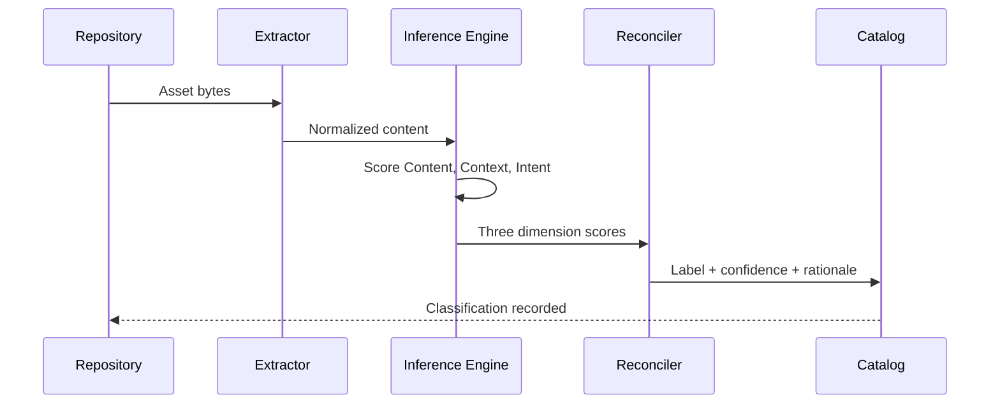

## Overview

These notes describe how the ARMOR inference engine turns raw signals into a classification decision. The engine treats classification as a reconciliation problem: three independent scorers propose a view, and a reconciliation layer produces one label with a confidence value and an explanation.

<Callout kind="tip">
  These are conceptual notes, not an API contract. For the request and response shapes, see the [Technical Briefing](/technical-architecture-security-and-privacy/technical-briefing).
</Callout>

## Inference sequence



## Design notes

<ExpandableGroup>
  <Expandable title="Why three scorers instead of one model" default-open="true">
    Separating Content, Context, and Intent keeps each signal auditable. When a label is challenged, you can see which dimension drove it rather than treating the model as a black box.
  </Expandable>

  <Expandable title="How confidence is calculated" default-open="false">
    Confidence blends the agreement between the three dimensions with the strength of each individual score. High agreement and high individual scores yield high confidence; disagreement lowers it and routes the asset to review.
  </Expandable>

  <Expandable title="How re-classification is triggered" default-open="false">
    Assets are re-evaluated when their content changes, when their sharing scope changes, or when you update a category definition. Only affected assets are re-scored, which keeps large estates efficient.
  </Expandable>
</ExpandableGroup>

## Reading an inference result

A single inference result carries the label, the per-dimension scores, and a short rationale. The examples below show the same result in two forms.

<CodeGroup tabs="JSON,Explanation">
  ```json
  {
    "asset_id": "s3://finance-reports/q3-forecast.xlsx",
    "label": "Financial / Confidential",
    "confidence": 0.94,
    "dimensions": {
      "content": 0.97,
      "context": 0.91,
      "intent": 0.88
    },
    "rationale": "Revenue projections in a restricted finance repository."
  }
  ```

  ```text
  Label:      Financial / Confidential
  Confidence: 0.94 (high, dimensions agree)
  Content:    0.97  revenue and forecast figures detected
  Context:    0.91  restricted finance repository
  Intent:     0.88  limited internal sharing scope
  ```
</CodeGroup>

<Callout kind="info">
  Rationale text is generated for human review. Treat it as an explanation aid, not as a stored policy value.
</Callout>
