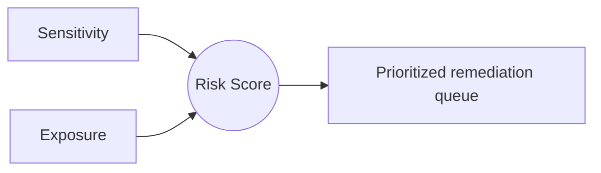

## Overview

ARMOR DSPM expresses risk as the combination of two dimensions: **Sensitivity** (how much the data matters) and **Exposure** (how reachable it is). Neither dimension alone tells you where to act. A highly sensitive file locked down to one owner is low risk; a moderately sensitive file shared publicly can be high risk. ARMOR ranks findings by the product of the two so your team works the most consequential exposures first.

## The two dimensions

<Columns cols="2">
  <Card title="Sensitivity" href="/fundamentals-and-functionality/fundamentals/ai-based-document-classification" icon="shield" horizontal="false">
    Derived from classification: category, regulated data types, and business context. Higher sensitivity means greater impact if the asset is exposed.
  </Card>

  <Card title="Exposure" href="/fundamentals-and-functionality/fundamentals/category-and-data-type-alignment" icon="radar" horizontal="false">
    Derived from reachability: sharing scope, access breadth, location, and whether the asset is reachable by AI systems or external identities.
  </Card>
</Columns>

## How the score is composed

## Risk tiers

| Sensitivity | Exposure | Resulting tier | Typical action |
|-------------|----------|----------------|----------------|
| High | High | Critical | Remediate immediately |
| High | Low | Elevated | Review access, confirm controls |
| Low | High | Elevated | Reduce sharing scope |
| Low | Low | Low | Monitor |

<Callout kind="alert">
  A Critical tier finding means sensitive data is broadly reachable right now. Treat these as time-sensitive, not as backlog.
</Callout>

## Why business impact matters

Traditional scanners flood teams with findings that are technically true but practically low value. ARMOR weights Context so that the same data type can carry different sensitivity depending on the owning team and repository. This keeps the Critical queue short and actionable.

<Callout kind="tip">
  Start each week from the Critical and Elevated tiers. If those queues are empty, you are in a healthy posture; spend the remaining time tightening categories.
</Callout>
