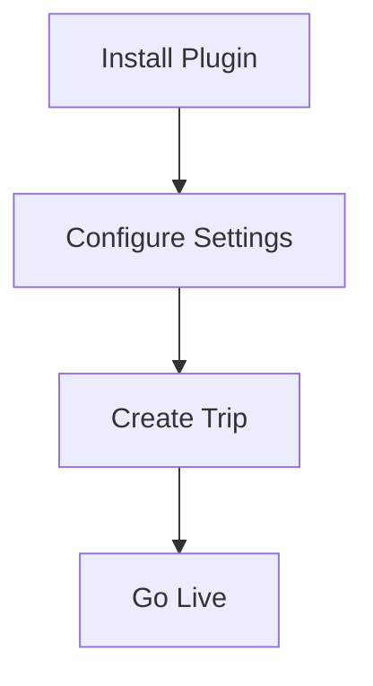

## Prerequisites

Before installing WP Travel Engine, ensure your WordPress site meets these requirements:

<Callout kind="info" title="System Requirements">
- WordPress 5.0 or higher
- PHP 7.4 or greater
- MySQL 5.6+ or MariaDB 10.1+
- Minimum 256MB memory (recommended 512MB+)
</Callout>

Verify your hosting environment supports these specs. Test your site with the [WordPress Health Check tool](https://wordpress.org/plugins/health-check/).

## Installation Methods

Choose the method that fits your workflow. Use the WordPress dashboard for simplicity, or manual upload for custom setups.

<Tabs>
  <Tab title="WordPress Dashboard" icon="settings">

<Steps>
  <Step title="Download the Plugin">
    Get the latest WP Travel Engine ZIP from your purchase dashboard or the official WordPress repository.
  </Step>

  <Step title="Upload and Install">
    Navigate to **Plugins > Add New > Upload Plugin** in your WordPress admin.
    
    Select the ZIP file and click **Install Now**.
  </Step>

  <Step title="Activate">
    After installation, click **Activate Plugin** to enable WP Travel Engine.
  </Step>
</Steps>

  </Tab>

  <Tab title="Manual FTP Upload" icon="upload">

<Steps>
  <Step title="Extract Files">
    Unzip the WP Travel Engine package on your computer.
  </Step>

  <Step title="Upload via FTP">
    Use an FTP client like FileZilla to upload the plugin folder to `/wp-content/plugins/wptravelengine/`.
  </Step>

  <Step title="Activate in Dashboard">
    Go to **Plugins** in WordPress admin and activate WP Travel Engine.
  </Step>
</Steps>

````bash
# Example FTP command (using lftp for automation)
lftp -u username,password ftp.example.com -e "mirror /local/path/to/wptravelengine /wp-content/plugins/; quit"
````

  </Tab>
</Tabs>

## Basic Configuration

After activation, configure essential settings:

<Steps>
  <Step title="Access Settings" icon="settings">
    Go to **WP Travel Engine > Settings** in your admin menu.
  </Step>

  <Step title="Set Currency and Units" icon="dollar-sign">
    Choose your default currency (e.g., USD), date format, and measurement units.
  </Step>

  <Step title="Enable Features" icon="check-circle">
    Turn on trip inquiry forms, booking options, and payment gateways.
  </Step>

  <Step title="Save Changes">
    Click **Save Settings** to apply.
  </Step>
</Steps>

<CodeGroup tabs="PHP Shortcode,Block Editor">
```php
// Add this shortcode to any page to display trips
[wptravel_trip_search]
[wptravel_trips]
```

```jsx
// In Gutenberg Block Editor, search for "WP Travel Engine" blocks
// Add: Trip Search, Trips List, Single Trip
```
</CodeGroup>

## Troubleshooting Common Issues

<ExpandableGroup>
  <Expandable title="Plugin Not Appearing in Menu?" default-open="true">
    Clear any caching plugins (e.g., WP Rocket, W3 Total Cache). Deactivate conflicting plugins like other travel or booking tools. Ensure user role has admin privileges.
  </Expandable>

  <Expandable title="White Screen or Errors?">
    Increase PHP memory limit in `wp-config.php`:
    
````php
define('WP_MEMORY_LIMIT', '512M');
````

    Check error logs via hosting panel or enable WP debug mode.
  </Expandable>

  <Expandable title="Bookings Not Working?">
    Verify permalinks: **Settings > Permalinks > Save Changes**. Install required add-ons like payment gateways if needed.
  </Expandable>
</ExpandableGroup>

<Callout kind="tip" title="Need Help?">
Review the [WP Travel Engine support forums](https://wptravelengine.com/support/) or contact your hosting provider for server issues.
</Callout>

## Next Steps

<Columns cols={3}>
  <Card title="Create Your First Trip" icon="map" href="/create-trip">
    Learn how to add itineraries, pricing, and galleries.
  </Card>

  <Card title="Configure Payments" icon="credit-card" href="/payments">
    Set up gateways like PayPal or Stripe.
  </Card>

  <Card title="Customize Templates" icon="brush" href="/customization">
    Style your travel site with blocks and themes.
  </Card>
</Columns>



Your WP Travel Engine site is now ready. Start building trips and bookings!