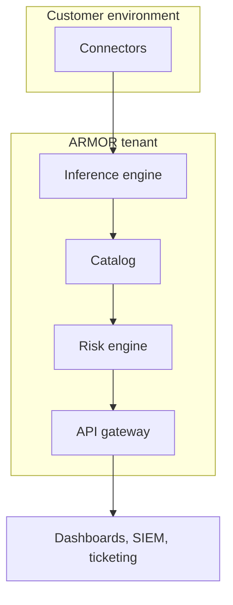

## Overview

This page describes the ARMOR DSPM component architecture and the topologies teams commonly deploy. Use it alongside the [Technical Briefing](/technical-architecture-security-and-privacy/technical-briefing) for the data flow and API detail.

## Component architecture



## Deployment topologies

<Tabs>
  <Tab title="Single region" icon="map-pin">
    Connectors and tenant share one region. Simplest to operate and the default for teams with a single residency requirement.
  </Tab>

  <Tab title="Multi region" icon="globe">
    Connectors run in each data region and stream to a residency-appropriate tenant. Used when regulated data must stay in jurisdiction.
  </Tab>

  <Tab title="Hybrid" icon="server">
    On-premises connectors reach internal sources while cloud connectors cover SaaS and cloud stores. Findings converge in one catalog.
  </Tab>
</Tabs>

## Connector sizing reference

Size a connector by the volume it must scan. The snippet is a starting point, not a guarantee.

```yaml title="connector-sizing.yaml"
sizing:
  small:   { assets_per_day: 100000,  vcpus: 2,  memory_gb: 8 }
  medium:  { assets_per_day: 1000000, vcpus: 4,  memory_gb: 16 }
  large:   { assets_per_day: 5000000, vcpus: 8,  memory_gb: 32 }
```

<Callout kind="info">
  These are illustrative figures for the documentation showcase. Validate sizing against your own repositories during a pilot.
</Callout>
