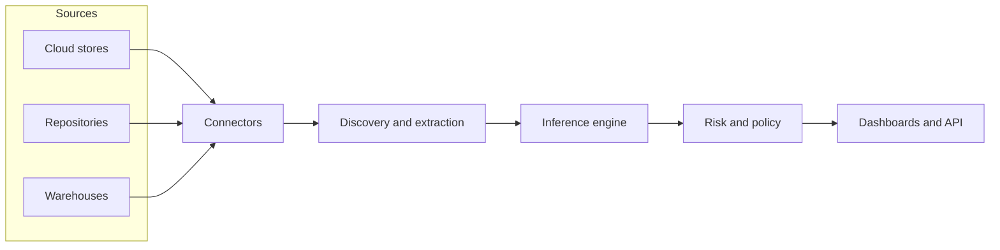

## Overview

This section explains how ARMOR DSPM is built, deployed, and secured. If you are evaluating ARMOR for a regulated environment, or planning an integration, start here and follow the cards below into the detailed pages.

<Callout kind="info">
  ARMOR DSPM runs in regulated environments and supports deployment on AWS and Google Cloud Platform with data-sovereignty considerations across jurisdictions.
</Callout>

## How the pieces fit together

## Explore this section

<Columns cols="2">
  <Card title="Technical Briefing" href="/technical-architecture-security-and-privacy/technical-briefing" icon="cpu" horizontal="false">
    The deployment model, data flow, and the classification API surface.
  </Card>

  <Card title="Security, Privacy & Compliance" href="/technical-architecture-security-and-privacy/security-privacy-and-compliance" icon="lock" horizontal="false">
    How ARMOR protects data in transit and at rest, and which frameworks it supports.
  </Card>

  <Card title="Architecture" href="/technical-architecture-security-and-privacy/architecture/todo" icon="network" horizontal="false">
    Deployment topologies and component-level diagrams.
  </Card>

  <Card title="Fundamentals" href="/fundamentals-and-functionality/fundamentals/ai-based-document-classification" icon="lightbulb" horizontal="false">
    The concepts behind classification and risk, in plain language.
  </Card>
</Columns>

<Callout kind="tip">
  New to ARMOR? Read the [Product Briefing](/fundamentals-and-functionality/functionality/product-briefing) first, then return here for the technical detail.
</Callout>
