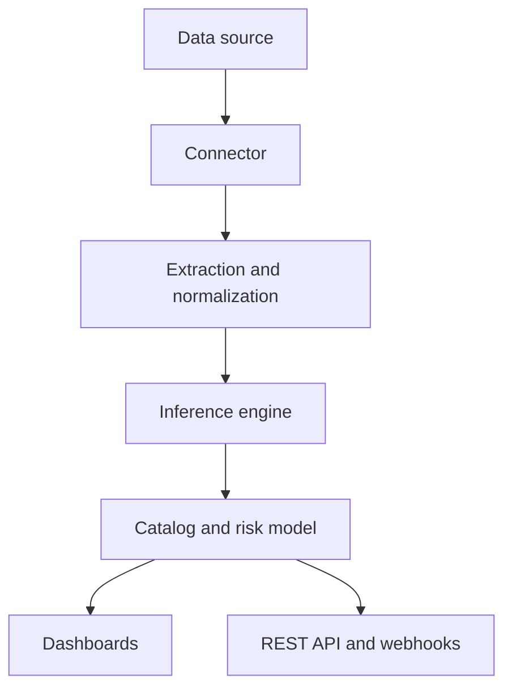

## Overview

This briefing covers how ARMOR DSPM is deployed, how data flows through the platform, and how to drive discovery and classification programmatically. It is written for architects and platform engineers planning an ARMOR integration.

## Deployment model

<Steps>
  <Step title="Provision the ARMOR tenant" icon="server">
    Choose an AWS or GCP region that satisfies your data-residency requirements. The tenant hosts the inference engine, catalog, and dashboards.
  </Step>

  <Step title="Deploy connectors" icon="plug">
    Connectors run close to your data sources and stream only extracted, normalized content to the inference engine.
  </Step>

  <Step title="Connect data sources" icon="database">
    Register cloud stores, repositories, and warehouses. Discovery begins automatically after the first successful connection.
  </Step>

  <Step title="Integrate downstream" icon="webhook">
    Send findings to your SIEM, ticketing, or policy engine using the API and webhooks.
  </Step>
</Steps>

## Data flow



## Connector configuration

Configure a connector with a small declarative block. The example shows the same connector in three formats.

<CodeGroup show-lines="true" tabs="YAML,JSON,Bash">
  ```yaml
  connector:
    id: s3-finance
    type: aws-s3
    region: us-east-1
    bucket: finance-reports
    scan: on-change
  ```

  ```json
  {
    "connector": {
      "id": "s3-finance",
      "type": "aws-s3",
      "region": "us-east-1",
      "bucket": "finance-reports",
      "scan": "on-change"
    }
  }
  ```

  ```bash
  armor connectors create \
    --id s3-finance \
    --type aws-s3 \
    --region us-east-1 \
    --bucket finance-reports \
    --scan on-change
  ```
</CodeGroup>

## Classification API

Submit an asset for classification and receive a label with per-dimension scores.

<ParamField header="Authorization" param-type="string" required="true" deprecated="false">
  Bearer token for API authentication. Format: `Bearer YOUR_API_KEY`.
</ParamField>

<ParamField body="asset-uri" param-type="string" required="true" deprecated="false">
  The location of the asset to classify, for example an S3 URI or repository path.
</ParamField>

<ParamField body="workspace" param-type="string" required="false" deprecated="false">
  Optional workspace hint used to weight Context. Defaults to the connector's workspace.
</ParamField>

<Request show-lines="true" tabs="cURL,Python">
  ```bash
  curl -X POST 'https://api.armor.example.com/v1/classify' \
    -H 'Authorization: Bearer YOUR_API_KEY' \
    -H 'Content-Type: application/json' \
    -d '{"asset-uri": "s3://finance-reports/q3-forecast.xlsx", "workspace": "finance"}'
  ```

  ```python
  import requests

  response = requests.post(
      "https://api.armor.example.com/v1/classify",
      headers={"Authorization": "Bearer YOUR_API_KEY"},
      json={"asset-uri": "s3://finance-reports/q3-forecast.xlsx", "workspace": "finance"},
  )
  data = response.json()
  ```
</Request>

<Response show-lines="true" tabs="200,401">
  ```json
  {
    "asset_id": "s3://finance-reports/q3-forecast.xlsx",
    "label": "Financial / Confidential",
    "confidence": 0.94,
    "risk_tier": "Critical",
    "dimensions": { "content": 0.97, "context": 0.91, "intent": 0.88 }
  }
  ```

  ```json
  {
    "error": "unauthorized",
    "code": "AUTH_INVALID_TOKEN",
    "message": "The provided API key is missing or invalid."
  }
  ```
</Response>

## Response fields

<ResponseField name="label" field-type="string" required="true" deprecated="false">
  The assigned classification in `Category / Sensitivity` form.
</ResponseField>

<ResponseField name="confidence" field-type="number" required="true" deprecated="false">
  A value between 0 and 1 indicating agreement across the Semantic Triad.
</ResponseField>

<ResponseField name="risk_tier" field-type="string" required="false" deprecated="false">
  The computed tier: `Low`, `Elevated`, or `Critical`.
</ResponseField>

<Callout kind="alert">
  Rate limits apply. The classification endpoint allows 600 requests per minute per tenant; bursts above the limit receive a `429` response with a `Retry-After` header.
</Callout>
